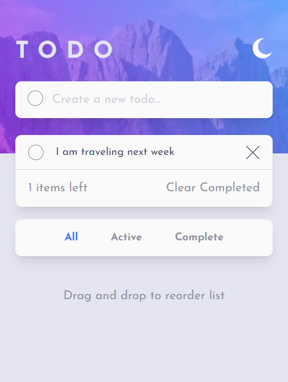
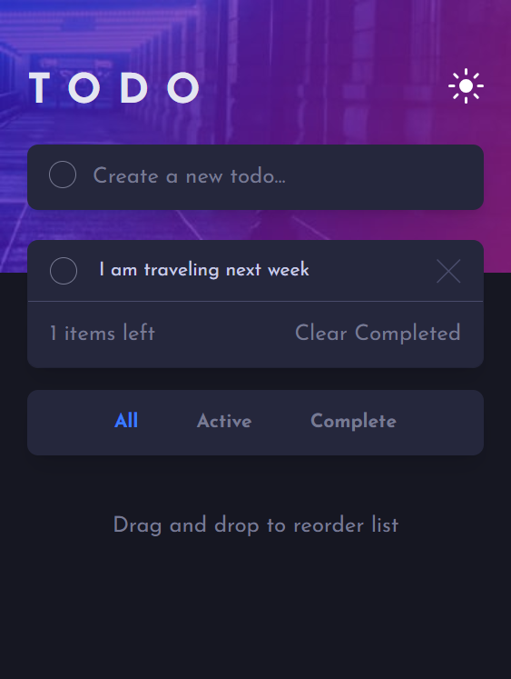
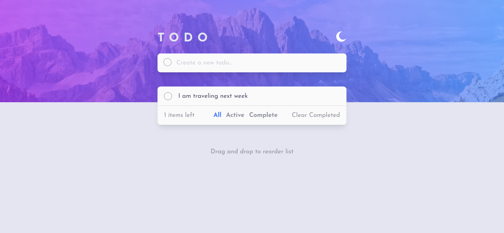
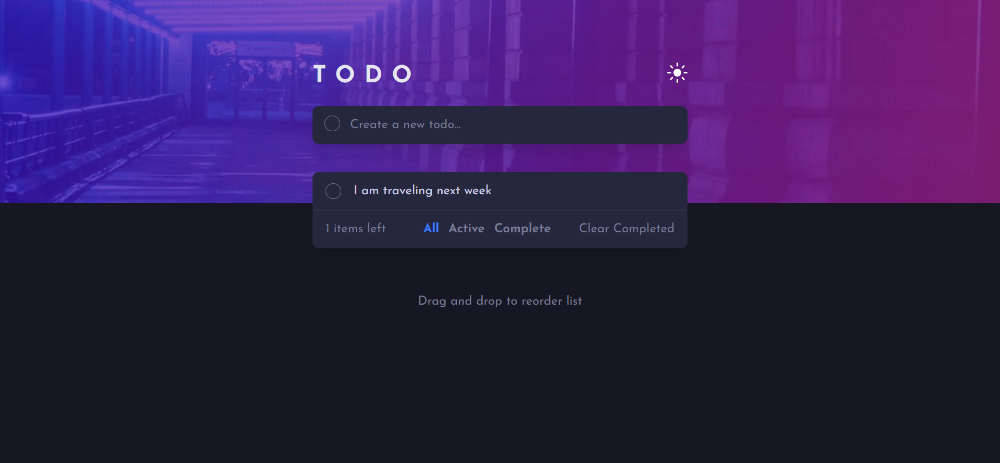

# Frontend Mentor - Todo app solution

This is a solution to the [Todo app challenge on Frontend Mentor](https://www.frontendmentor.io/challenges/todo-app-Su1_KokOW). Frontend Mentor challenges help you improve your coding skills by building realistic projects. 

## Table of contents

- [Overview](#overview)
  - [The challenge](#the-challenge)
  - [Screenshot](#screenshot)
  - [Links](#links)
- [My process](#my-process)
  - [Built with](#built-with)
  - [What I learned](#what-i-learned)
- [Author](#author)

## Overview

### The challenge

Users should be able to:

- View the optimal layout for the app depending on their device's screen size
- See hover states for all interactive elements on the page
- Add new todos to the list
- Mark todos as complete
- Delete todos from the list
- Filter by all/active/complete todos
- Clear all completed todos
- Toggle light and dark mode
- **Bonus**: Drag and drop to reorder items on the list

### Screenshot

### Links

- Solution URL: [https://todo-app-ruby-xi.vercel.app/](https://todo-app-ruby-xi.vercel.app/)
- Live Site URL: [https://github.com/oma16/todo-app](https://github.com/oma16/todo-app)

## My process

### Built with

- Semantic HTML5 markup
- CSS custom properties
- Flexbox
- CSS Grid
- Mobile-first workflow
- [React](https://reactjs.org/) - JS library
- [Next.js](https://nextjs.org/) - React framework
- [Tailwind](https://tailwind.com) - For styles

### What I learned
I learnt array methods such as filter, map , drag and drop event,storing data in localStorage.

## Author

- Website - [Add your name here](https://www.your-site.com)
- Frontend Mentor - [@oma16](https://www.frontendmentor.io/profile/oma16)
- Twitter - [@yourusername](https://www.twitter.com/yourusername)

